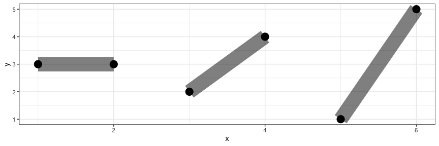

<!-- README.md is generated from README.Rmd. Please edit that file -->

# ggtwotone

<!-- badges: start -->

<!-- badges: end -->

`ggtwotone` is an R package that extends `ggplot2` with dual-stroke and
contrast-aware geoms. It helps you create clear, high-contrast
annotations and lines that remain visible across complex or variable
backgrounds.

## What’s Inside

- geom_segment_dual() Dual-stroke line segments with vertical offset

- geom_lm_dual() Dual-tone regression line with contrast-aware strokes

- geom_curve_dual() Dual-stroke curved line annotations

- geom_curve_dual_function() Plot mathematical or statistical functions
  as smooth dual-stroke curves

- geom_text_contrast() Automatically switches between light/dark text
  color based on background

- adjust_contrast_pair() Helper function to find contrast-boosted color
  pairs using WCAG/APCA

## Installation

You can install the development version of ggtwotone from
[GitHub](https://github.com/) with:

``` r
# install.packages("pak")
pak::pak("bwanniarachchige2/ggtwotone")
```

## Example

This is a basic example which shows you how to solve a common problem:

``` r
library(ggplot2)
library(ggtwotone)

df <- data.frame(x = 1:3, y = 1, xend = 1:3, yend = 2)

ggplot(df) +
  geom_segment_dual(
    aes(x = x, y = y, xend = xend, yend = yend),
    color1 = "#FFFFFF", color2 = "#000000", linewidth = 2
  ) +
  theme_dark()
```


``` r
ggplot() +
  geom_curve_dual_function(
    fun = dnorm,
    xlim = c(-3, 3),
    color1 = "#EEEEEE", color2 = "#222222",
    offset = 0.004,
    linewidth = 1.2,
    smooth = TRUE
  ) +
  theme_dark()
```



``` r
library(dplyr)

# Zone-colored background
set.seed(42)
tile_df <- expand.grid(x = -7:7, y = -7:7)
zones <- c("Desert", "Forest", "Sea", "Urban")
zone_colors <- c(
  "Desert" = "#EDC9AF",
  "Forest" = "#14532d",
  "Sea"    = "#0F3556",
  "Urban"  = "#888888"
)
tile_df$zone <- sample(zones, nrow(tile_df), replace = TRUE)
tile_df$fill <- zone_colors[tile_df$zone]

# Simulated wind directions and speeds
angle <- seq(0, 360, by = 15)
speed <- runif(length(angle), min = 1, max = 3.5)  # Wind speed in m/s
scale_factor <- 1.8  # Increase arrow length visually

wind_df <- data.frame(
  x = 0, y = 0,
  angle = angle,
  speed = speed,
  xend = scale_factor * speed * cos(angle * pi / 180),
  yend = scale_factor * speed * sin(angle * pi / 180)
)

# Plot
ggplot() +
  geom_tile(data = tile_df, aes(x = x, y = y, fill = zone)) +
  scale_fill_manual(values = zone_colors, name = "Zone Type") +

  geom_segment_dual(
    data = wind_df,
    aes(x = x, y = y, xend = xend, yend = yend),
    color1 = "#FFFFFF", color2 = "#111111",
    linewidth = 1.1,
    arrow = arrow(length = unit(0.15, "inches"), type = "open"),
    alpha = 0.9
  ) +

  coord_fixed(xlim = c(-5, 5), ylim = c(-5, 5)) +
  theme_minimal(base_size = 14) +
  theme(
    panel.background = element_rect(fill = "white", color = NA)
  ) +
  labs(
    title = "Wind Directions Across Zones",
    subtitle = "Arrow length scaled to represent wind speed (m/s); \ndual-stroke arrows ensure readability across terrain",
    x = "Longitude",
    y = "Latitude"
  )
```


This example visualizes wind directions and speeds over a
zone-classified terrain map using `geom_segment_dual()`.  
Arrow length is scaled by wind speed (in m/s), and dual-stroke styling
ensures clear visibility across contrasting terrain types such as
desert, forest, sea, and urban zones.

# Motivation

In real-world plots, especially on mixed backgrounds (grayscale tiles,
images, or map layers), default ggplot2 annotations can disappear.
ggtwotone solves this with:

- Dual-stroke visibility: top and bottom layers ensure readability

- Contrast checking: uses APCA/WCAG to optimize color pairing

- Fallback safety: gracefully assigns black/white when needed

You can explore all functions in the
[Reference](https://bwanniarachchige2.github.io/ggtwotone/) Manual, or
see them in the R help tab after loading the package.
