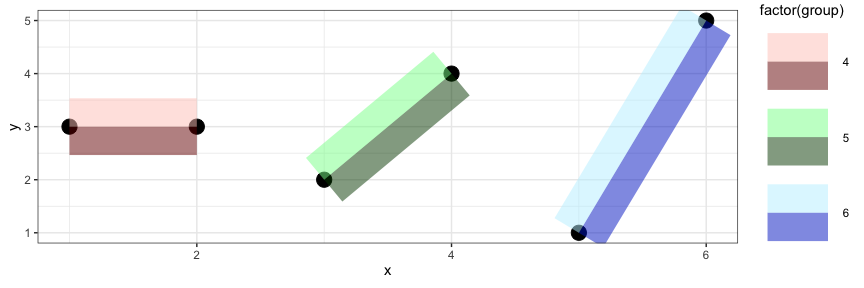

<!-- README.md is generated from README.Rmd. Please edit that file -->

# ggtwotone

<!-- badges: start -->

<!-- badges: end -->

`ggtwotone` is an R package that extends `ggplot2` with dual-stroke and
contrast-aware geoms. It helps you create clear, high-contrast
annotations and lines that remain visible across complex or variable
backgrounds.

## What’s Inside

- geom_segment_dual(): Dual-stroke line segments with vertical offset

- geom_lm_dual(): Dual-tone regression line with contrast-aware strokes

- geom_curve_dual(): Dual-stroke curved line annotations

- geom_curve_dual_function(): Plot mathematical or statistical functions
  as smooth dual-stroke curves

- geom_text_contrast(): Automatically switches between light/dark text
  color based on background

- adjust_contrast_pair(): Helper function to find contrast-boosted color
  pairs using WCAG/APCA

## Installation

You can install the development version of ggtwotone from
[GitHub](https://github.com/) with:

``` r
# install.packages("pak")
pak::pak("bwanniarachchige2/ggtwotone")
```

## Example

These are some examples which show you how to use the package:

``` r
library(ggplot2)
library(ggtwotone)
library(magick)
#> Linking to ImageMagick 6.9.12.93
#> Enabled features: cairo, fontconfig, freetype, heic, lcms, pango, raw, rsvg, webp
#> Disabled features: fftw, ghostscript, x11
library(grid)

img <- magick::image_read("man/figures/background_image.jpg")

# Convert image to a rasterGrob
bg_grob <- grid::rasterGrob(img, width = unit(1,"npc"), height = unit(1,"npc"))

# Plot
ggplot() +
  annotation_custom(bg_grob, xmin = -Inf, xmax = Inf, ymin = -Inf, ymax = Inf) +

  geom_curve_dual_function(
    fun = dnorm,
    xlim = c(-3, 6),
    color1 = "#FFFFFF",
    color2 = "#000000",
    offset = 0.003,
    linewidth = 1.2,
    smooth = TRUE
  ) +

  geom_curve_dual_function(
    fun = function(x) 0.5 * exp(-abs(x - 2)),
    xlim = c(-3, 6),
    color1 = "#FFFFCC",
    color2 = "#4B0000",
    offset = 0.003,
    linewidth = 1.2,
    smooth = TRUE
  ) +

  coord_cartesian(ylim = c(0, 0.5)) +
  theme_void() +
  theme(
    plot.background = element_rect(fill = "transparent", color = NA),
    panel.background = element_rect(fill = "transparent", color = NA)
  ) +
  labs(
    title = "Curves over Image Background",
    subtitle = "Dual-stroke rendering stays visible over image background"
  )
```


``` r
library(dplyr)
#> 
#> Attaching package: 'dplyr'
#> The following objects are masked from 'package:stats':
#> 
#>     filter, lag
#> The following objects are masked from 'package:base':
#> 
#>     intersect, setdiff, setequal, union

# Zone-colored background
set.seed(42)
tile_df <- expand.grid(x = -7:7, y = -7:7)
zones <- c("Desert", "Forest", "Sea", "Urban")
zone_colors <- c(
  "Desert" = "#EDC9AF",
  "Forest" = "#14532d",
  "Sea"    = "#0F3556",
  "Urban"  = "#eeeeee"
)
tile_df$zone <- sample(
  zones,
  size = nrow(tile_df),
  replace = TRUE,
  prob = c(0.2, 0.2, 0.4, 0.2)
)

# Realistic wind vectors
set.seed(42)
n <- 25
wind_df <- data.frame(
  x = sample(-4:4, n, replace = TRUE),
  y = sample(-4:4, n, replace = TRUE),
  angle = runif(n, 180, 270),  # Southwest quadrant
  speed = runif(n, 1.5, 4)     # Speed in m/s
) |>
  mutate(
    xend = x + speed * cos(angle * pi / 180),
    yend = y + speed * sin(angle * pi / 180)
  )

# Plot
ggplot() +
  geom_tile(data = tile_df, aes(x = x, y = y, fill = zone)) +
  scale_fill_manual(values = zone_colors, name = "Zone Type") +

  geom_segment_dual(
    data = wind_df,
    aes(x = x, y = y, xend = xend, yend = yend),
    color1 = "#FFFFFF", color2 = "#111111",
    linewidth = 1.2,
    arrow = arrow(length = unit(0.15, "inches"), type = "open"),
    alpha = 0.9
  ) +

  coord_fixed(xlim = range(c(wind_df$x, wind_df$xend)),
            ylim = range(c(wind_df$y, wind_df$yend))) +
  theme_minimal(base_size = 14) +
  theme(
    panel.background = element_rect(fill = "white", color = NA)
  ) +
  labs(
    title = "Wind Directions Across Zones",
    subtitle = "Arrow direction and length represent wind flow and speed (m/s);\ndual-stroke improves visibility",
    x = "Longitude",
    y = "Latitude"
  )
```


This example visualizes wind directions and speeds over a
zone-classified terrain map using `geom_segment_dual()`.  
Arrow length is scaled by wind speed (in m/s), and dual-stroke styling
ensures clear visibility across contrasting terrain types such as
desert, forest, sea, and urban zones.

``` r
library(ggplot2)
library(ggtwotone)

df <- mpg

# plot
ggplot(df, aes(x = displ, y = hwy)) +
  geom_point(color = "darkgreen", size = 3, alpha = 0.7) +

  geom_lm_dual(
    data = df,
    mapping = aes(x = displ, y = hwy),
    method = "lm",
    formula = hwy ~ displ,
    base_color = "#555555",
    contrast = 4.5,
    method_contrast = "auto",
    linewidth = 1.2
  ) +

  theme_minimal(base_size = 14) +
  labs(
    title = "Engine Displacement vs. Highway MPG",
    subtitle = "Regression line with dual-stroke contrast for visibility",
    x = "Displacement (L)",
    y = "Highway MPG"
  )
```


``` r
library(dplyr)

# Sample from real storm data
data("storms", package = "dplyr")

storm_subset <- storms %>%
  filter(name == "Katrina", year == 2005) %>%
  mutate(
    x = lag(long), y = lag(lat),
    xend = long, yend = lat
  ) %>%
  filter(!is.na(x), !is.na(y))  # remove first row with NA lag

# Plot
ggplot(storm_subset) +
  geom_segment_dual(
    aes(x = x, y = y, xend = xend, yend = yend, group = 1),
    color1 = "white", color2 = "black",
    linewidth = 1.2,
    arrow = arrow(length = unit(0.08, "inches"), type = "open")
  ) +
  geom_point(aes(x = xend, y = yend, color = wind), size = 2) +
  scale_color_viridis_c(option = "C", name = "Wind Speed") +
  coord_fixed() +
  labs(
    title = "Storm Track of Hurricane Katrina (2005)",
    subtitle = "Arrow direction shows storm movement; \nstroke ensures visibility on top of wind-colored dots",
    x = "Longitude", y = "Latitude"
  ) +
  theme_dark()
```


# Drawing two lines side by side

The basic idea of drawing line segments with the `segment_dual` geom is
to replace any line segment from A to B by two line segments drawn side
by sidein different color hues chosen such that at least one of the
coior hues has a sufficiently large (color) contrast to any background
colors.

``` r
dframe <- data.frame(x =c(1,3,5), xmax = c(2, 4, 6), y = c(3,2,1), ymax=c(3,4,5), group = 1:3)
dframe |> 
  ggplot(aes(x = x, xend=xmax, y = y, yend=ymax)) + 
  geom_segment(aes(group = group), linewidth = 10, alpha = 0.5) +
  theme_bw() + 
  geom_point(size = 5) + 
  geom_point(aes(x = xmax, y = ymax), size = 5)
```



``` r

dframe |> 
  ggplot(aes(x = x, xend=xmax, y = y, yend=ymax)) + 
  geom_segment_dual(aes(group = group), color1 = "darkorange", color2 = "steelblue", linewidth = 10, alpha = 0.5) +
  theme_bw() + 
  geom_point(size = 5) + 
  geom_point(aes(x = xmax, y = ymax), size = 5)
```


# Motivation

In real-world plots, especially on mixed backgrounds (grayscale tiles,
images, or map layers), default ggplot2 annotations can disappear.
ggtwotone solves this with:

- Dual-stroke visibility: top and bottom layers ensure readability

- Contrast checking: uses APCA/WCAG to optimize color pairing

- Fallback safety: gracefully assigns black/white when needed

You can explore all functions in the
[Reference](https://bwanniarachchige2.github.io/ggtwotone/) Manual, or
see them in the R help tab after loading the package.
